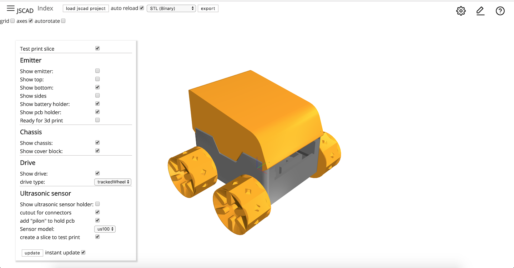
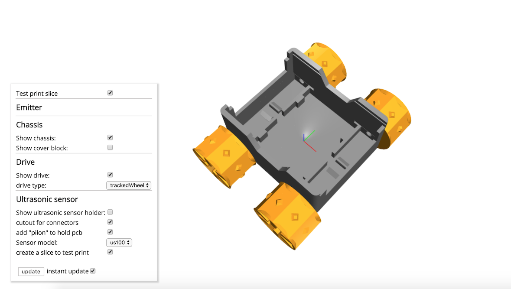
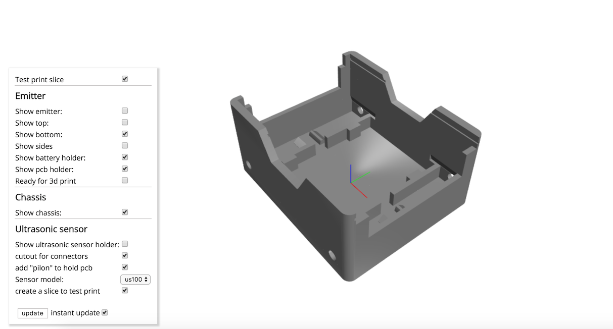
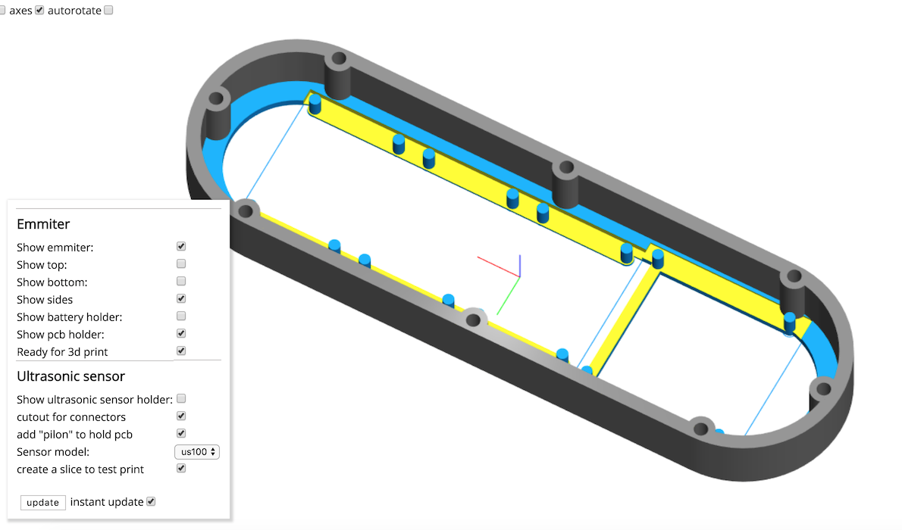
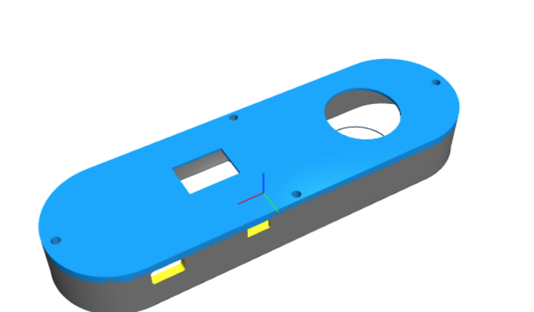
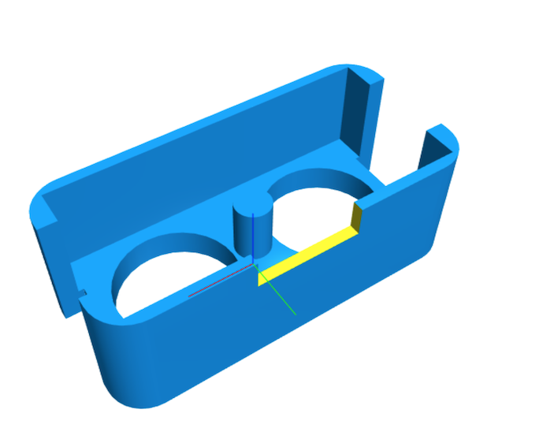

# SMARS-jscad

>*SMARS-jscad* is a remake/ expansion of the [SMARS modular robot](https://www.thingiverse.com/thing:2662828) in OpenJSCAD!

## Table of Contents

- [Usage](#usage)
- [License](#license)
- [Screenshots](#screenshots)

## Usage

This package can currently only be used in the new version of JSCAD web V2 (written as npm module)
- install the web ui for JSCAD V2 (branch web-overhaul for now)
- clone this repository
- drag & drop this folder onto the JSCAD UI

## License

All parts based on the original SMARS have the same license as the original: 
 Creative Commons - Attribution - Non-Commercial - Share Alike
All new parts (remote control etc) use the [The MIT License (MIT)](./LICENSE)
(unless specified otherwise)

## Screenshots

